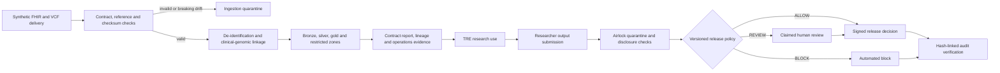
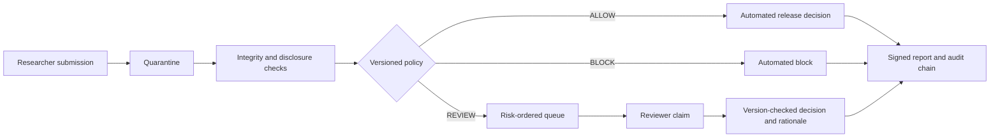
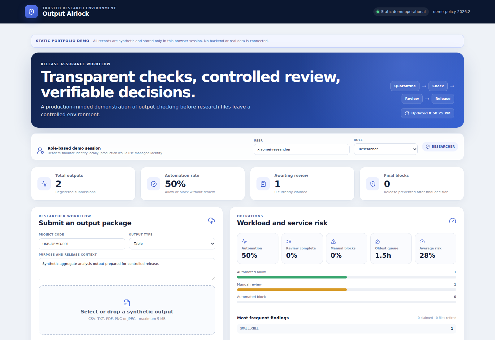
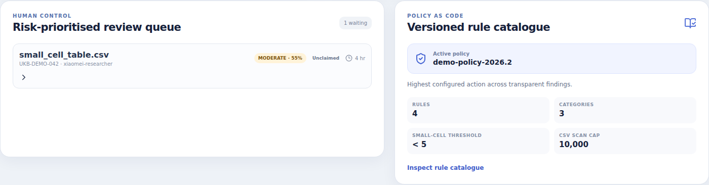
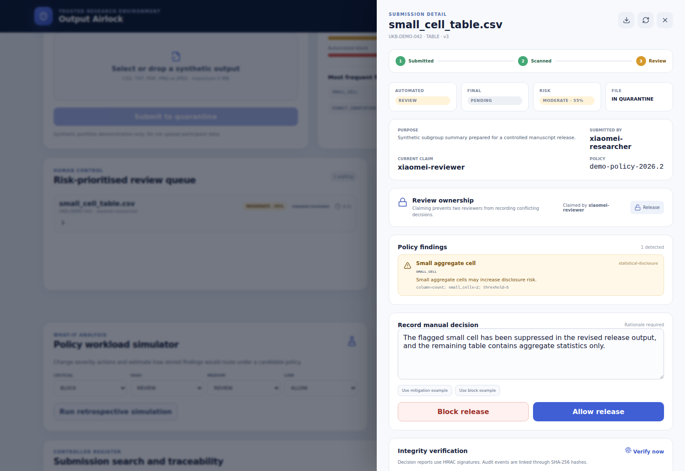

# TRE Output Airlock

[](https://github.com/xm2325/tre_output_airlock/actions/workflows/ci.yml)
[](https://github.com/xm2325/tre_output_airlock/actions/workflows/clinical-genomic-pipeline.yml)
[](https://github.com/xm2325/tre_output_airlock/actions/workflows/pages.yml)

[Open the browser-only synthetic Airlock demo](https://xm2325.github.io/tre_output_airlock/) · [Review the clinical–genomic pipeline](clinical_genomic_pipeline/README.md) · [Read the production-readiness gap analysis](docs/production-readiness.md)

A production-minded portfolio demonstration of the controlled data path around a trusted research environment (TRE): synthetic clinical and genomic ingestion, research-ready data publication, and disclosure review before outputs leave the TRE.

> **Safety boundary:** this repository uses synthetic files and demonstration policies. It is not affiliated with UK Biobank or Genomics England, does not implement either organisation's policy, and must not be used with real participant data.

## Problems addressed

A health-data platform must control both sides of research use.

Before analysis, it must verify clinical and genomic deliveries, detect contract changes, remove direct identifiers, separate restricted linkage material, record lineage and prevent partial publication.

After analysis, a release service must store outputs safely, explain risk evidence, route uncertain cases to reviewers, prevent conflicting actions, preserve history and support later verification.

## End-to-end control path



## Current portfolio scope

### Clinical–genomic ingestion

- a supported FHIR R4 subset for `Patient`, `Condition`, `Observation` and `Specimen`;
- VCF manifest checks for foreign keys, genome assembly, path safety and SHA-256;
- a versioned schema contract with `PASS`, `WARN` and `FAIL` results;
- a value-free schema fingerprint recorded in lineage;
- breaking schema drift quarantined before transformation;
- additive schema drift published with warning evidence;
- HMAC pseudonyms and deterministic patient-level date shifts;
- separate bronze, silver, gold and restricted zones;
- atomic publication, `_SUCCESS`, safe replay and structured quarantine evidence;
- Prefect task boundaries and retry policy;
- operations JSON and portable HTML for run, warning and quarantine state;
- an encrypted AWS S3, KMS, SQS and dead-letter Terraform baseline.

### TRE Output Airlock

The release workflow has three outcomes:

- `ALLOW`: no configured release concern was detected;
- `REVIEW`: a reviewer must claim the item and record a rationale;
- `BLOCK`: a critical condition prevents release.

The Airlock includes:

- researcher, reviewer and admin scopes;
- researcher ownership filtering;
- review claims and optimistic concurrency control;
- project and output-purpose metadata;
- server-side pagination, filtering and risk ordering;
- policy workload simulation;
- HMAC-signed decision reports;
- SHA-256-linked audit events and verification;
- explicit file-retention operations;
- PostgreSQL Docker Compose deployment;
- Alembic schema migration;
- Prometheus-style request metrics;
- a nine-case synthetic policy benchmark;
- an encrypted AWS quarantine and queue baseline;
- frontend unit tests and expanded CI gates.

## Airlock workflow



## Browser-only synthetic demo

The GitHub Pages build runs entirely in the browser with synthetic in-memory records. It supports role switching, review claims, policy simulation, report verification and synthetic uploads without sending files to a server. The Docker deployment uses the real FastAPI and PostgreSQL services.

## Product screenshots

### Researcher operations dashboard



### Risk-prioritised reviewer queue



### Claimed review with evidence and decision controls



## Main capabilities

### Backend

- FastAPI REST API and committed OpenAPI snapshot;
- streamed quarantine upload with a size limit and SHA-256 fingerprint;
- file-signature, direct-identifier, quasi-identifier, small-cell, uniqueness, free-text, formula and metadata checks;
- explicit, versioned rule-to-action policy;
- role and owner checks through a clearly marked demo identity layer;
- idempotent submission requests;
- review claim locking and stale-update protection through `row_version`;
- signed reports and hash-linked audit verification;
- PostgreSQL support and Alembic migration;
- readiness, structured logs, request IDs and Prometheus-style metrics;
- synthetic benchmark runner with documented limits.

### Frontend

- React and TypeScript dashboard;
- researcher, reviewer and admin views;
- project context and output-purpose capture;
- upload preflight and synthetic-data warning;
- queue ownership and reviewer actions;
- policy catalogue and retrospective policy simulator;
- server-side search, decision filters, sorting and pagination;
- report download, report verification and audit-chain verification;
- admin retention action;
- responsive interface and keyboard-accessible table rows.

### Delivery evidence

- 31 Airlock backend tests and a 90% coverage gate;
- 8 frontend unit and API contract tests;
- 8 clinical–genomic pipeline tests, including schema drift and operations state;
- Ruff, MyPy and TypeScript checks;
- frontend production build;
- npm and Python dependency-audit gates in CI;
- migration smoke test;
- OpenAPI snapshot check;
- synthetic policy benchmark check;
- direct-identifier scans across research-ready clinical data;
- data-contract fingerprint and operations evidence artifacts;
- Terraform format and validation checks;
- Docker Compose validation, full-stack startup smoke test and image build.

## Repository structure

```text
backend/                                FastAPI Airlock service, migration and tests
frontend/                               React + TypeScript Airlock dashboard and tests
clinical_genomic_pipeline/              FHIR/VCF ingestion, contracts, lineage and operations
benchmark/                              Synthetic Airlock benchmark manifest and results
samples/                                Synthetic ALLOW, REVIEW and BLOCK files
infra/aws/                              Airlock AWS quarantine baseline
infra/aws/clinical_genomic/             Clinical-genomic S3, KMS, SQS and IAM baseline
scripts/export_openapi.py               OpenAPI snapshot generator and check
docs/architecture.md                    Airlock runtime and production architecture
docs/clinical-genomic-platform.md       Upstream data-platform design and controls
docs/decision-policy.md                 Rule, action and policy-change model
docs/threat-model.md                    Assets, abuse cases and controls
docs/production-readiness.md            Demonstrated controls versus remaining work
docs/runbook.md                         Local operating and failure procedures
docs/adr/                               Recorded design decisions
VALIDATION.md                           Reproducible local validation record
```

Interview-specific notes are intentionally not included in this repository.

## Run the Airlock with Docker

```bash
cp .env.example .env
docker compose up --build
```

Open:

- dashboard: `http://localhost:5173`
- API documentation: `http://localhost:8000/docs`
- readiness: `http://localhost:8000/ready`
- telemetry: `http://localhost:8000/metrics`

Docker Compose uses PostgreSQL. The API container runs `alembic upgrade head` before startup.

## Run the Airlock without Docker

Backend with SQLite:

```bash
cd backend
uv sync --frozen --all-extras
uv run uvicorn app.main:app --reload
```

Frontend in another terminal:

```bash
cd frontend
npm ci
npm run dev
```

## Run the clinical–genomic path

```bash
cd clinical_genomic_pipeline
python -m pip install -e .
clinical-genomic-pipeline \
  --fhir samples/fhir_bundle.json \
  --manifest samples/genomic_manifest.csv \
  --output build/demo \
  --secret 'replace-with-a-long-demo-secret'
clinical-genomic-operations \
  --output build/demo \
  --json build/demo/operations-summary.json \
  --html build/demo/operations-dashboard.html
```

See [`clinical_genomic_pipeline/README.md`](clinical_genomic_pipeline/README.md) for the contract, outputs, test cases and production limits.

## Demo identity

The Docker-backed browser lets the user switch between `researcher`, `reviewer` and `admin`. It sends `X-Demo-User` and `X-Demo-Role` headers. This is only a local demonstration of authorisation logic, not authentication.

API example:

```bash
curl http://localhost:8000/api/v1/me \
  -H 'X-Demo-User: xiaomei-reviewer' \
  -H 'X-Demo-Role: reviewer'
```

## Airlock upload example

```bash
curl -X POST http://localhost:8000/api/v1/submissions \
  -H 'X-Demo-User: xiaomei-researcher' \
  -H 'X-Demo-Role: researcher' \
  -H "Idempotency-Key: $(python -c 'import uuid; print(uuid.uuid4())')" \
  -F 'project_code=UKB-DEMO-001' \
  -F 'output_type=TABLE' \
  -F 'output_description=Synthetic aggregate output for portfolio testing.' \
  -F 'file=@samples/small_cell_table.csv'
```

## Airlock review example

Claim the item first:

```bash
curl -X POST http://localhost:8000/api/v1/submissions/<id>/claim \
  -H 'X-Demo-User: xiaomei-reviewer' \
  -H 'X-Demo-Role: reviewer'
```

Then send the current version returned by the API:

```bash
curl -X POST http://localhost:8000/api/v1/submissions/<id>/review \
  -H 'X-Demo-User: xiaomei-reviewer' \
  -H 'X-Demo-Role: reviewer' \
  -H 'Content-Type: application/json' \
  -d '{
    "decision": "ALLOW",
    "rationale": "The flagged cell was suppressed in the revised aggregate output.",
    "expected_version": 3
  }'
```

## Synthetic Airlock benchmark

```bash
make benchmark
```

The committed benchmark contains nine synthetic cases. The current result is 9/9 expected workflow decisions and 100% unsafe-case triage into `REVIEW` or `BLOCK`. These values only test known code paths; they are not estimates for real research outputs.

## Validate

```bash
make validate
```

The clinical–genomic package has a separate GitHub Actions workflow that runs strict MyPy, Ruff, eight unit tests, repeatable sample execution, direct-identifier scans, contract and operations assertions, Terraform validation and evidence upload.

`pip-audit` requires network access to its vulnerability service. The same audit runs in GitHub Actions.

## Production boundary

Read [`docs/production-readiness.md`](docs/production-readiness.md) before describing this project as production-ready. Key remaining work includes managed identity, object-store quarantine, isolated asynchronous scanning, malware detection, managed signing keys, approved source-system profiles, central monitoring and paging, data-retention enforcement, a representative test corpus and independent privacy and disclosure-control review.

## Author

**Xiaomei Mi**  
PhD in Computer Science · Python · machine learning · health data · research software
