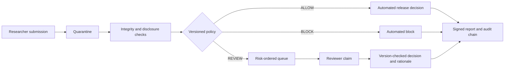

# TRE Output Airlock

A production-minded full-stack portfolio demonstration of research-output checking before files leave a trusted research environment (TRE).

> **Safety boundary:** this repository uses synthetic files and a demonstration policy. It is not affiliated with UK Biobank, does not implement UK Biobank policy, and must not be used with real participant data.

## Problem addressed

A TRE release service must do more than identify risky text. It must store an output safely, explain the evidence, route uncertain cases to people, prevent conflicting reviewer actions, preserve the history, and support later verification.

This project demonstrates that workflow through three outcomes:

- `ALLOW`: no configured release concern was detected;
- `REVIEW`: a reviewer must claim the item and record a rationale;
- `BLOCK`: a critical condition prevents release.

## Version 0.3.0

This version adds:

- researcher, reviewer and admin scopes;
- researcher ownership filtering;
- review claims and optimistic concurrency control;
- project and output-purpose metadata;
- server-side pagination, filtering and risk ordering;
- policy workload simulation;
- HMAC-signed decision reports;
- SHA-256-linked audit events and verification;
- explicit file-retention operations;
- PostgreSQL Docker Compose deployment;
- Alembic schema migration;
- Prometheus-style request metrics;
- a nine-case synthetic policy benchmark;
- an encrypted AWS quarantine and queue baseline;
- frontend unit tests and expanded CI gates.

## System workflow



## Main capabilities

### Backend

- FastAPI REST API and generated OpenAPI schema;
- streamed quarantine upload with a size limit and SHA-256 fingerprint;
- file-signature, direct-identifier, quasi-identifier, small-cell, uniqueness, free-text, formula and metadata checks;
- explicit, versioned rule-to-action policy;
- role and owner checks through a clearly marked demo identity layer;
- idempotent submission requests;
- review claim locking and stale-update protection through `row_version`;
- signed reports and hash-linked audit verification;
- PostgreSQL support and Alembic migration;
- readiness, structured logs, request IDs and Prometheus-style metrics;
- synthetic benchmark runner with documented limits.

### Frontend

- React and TypeScript dashboard;
- researcher, reviewer and admin views;
- project context and output-purpose capture;
- upload preflight and synthetic-data warning;
- queue ownership and reviewer actions;
- policy catalogue and retrospective policy simulator;
- server-side search, decision filters, sorting and pagination;
- report download, report verification and audit-chain verification;
- admin retention action;
- responsive interface and keyboard-accessible table rows.

### Delivery evidence

- 29 backend tests and a 90% coverage gate;
- 4 frontend unit tests;
- Ruff, MyPy and TypeScript checks;
- frontend production build;
- npm and Python dependency-audit gates in CI;
- migration smoke test;
- OpenAPI schema generation check;
- synthetic benchmark check;
- Docker Compose validation and image build.

## Repository structure

```text
backend/                         FastAPI service, Alembic migration and tests
frontend/                        React + TypeScript dashboard and tests
benchmark/                       Synthetic benchmark manifest and results
samples/                         Synthetic ALLOW, REVIEW and BLOCK files
infra/aws/                       Encrypted S3/SQS quarantine baseline
scripts/export_openapi.py        OpenAPI schema generator
docs/architecture.md             Runtime and production architecture
docs/decision-policy.md          Rule, action and policy-change model
docs/threat-model.md             Assets, abuse cases and controls
docs/production-readiness.md     Demonstrated controls versus remaining work
docs/runbook.md                  Local operating and failure procedures
docs/adr/                        Recorded design decisions
VALIDATION.md                    Reproducible local validation record
```


## Run with Docker

```bash
cp .env.example .env
docker compose up --build
```

Open:

- dashboard: `http://localhost:5173`
- API documentation: `http://localhost:8000/docs`
- readiness: `http://localhost:8000/ready`
- telemetry: `http://localhost:8000/metrics`

Docker Compose uses PostgreSQL. The API container runs `alembic upgrade head` before startup.

## Run without Docker

Backend with SQLite:

```bash
cd backend
python -m venv .venv
source .venv/bin/activate
python -m pip install -e '.[dev]'
uvicorn app.main:app --reload
```

Frontend in another terminal:

```bash
cd frontend
npm install
npm run dev
```

## Demo identity

The browser lets the user switch between `researcher`, `reviewer` and `admin`. It sends `X-Demo-User` and `X-Demo-Role` headers. This is only a local demonstration of authorisation logic, not authentication.

API example:

```bash
curl http://localhost:8000/api/v1/me \
  -H 'X-Demo-User: xiaomei-reviewer' \
  -H 'X-Demo-Role: reviewer'
```

## Upload example

```bash
curl -X POST http://localhost:8000/api/v1/submissions \
  -H 'X-Demo-User: xiaomei-researcher' \
  -H 'X-Demo-Role: researcher' \
  -H "Idempotency-Key: $(python -c 'import uuid; print(uuid.uuid4())')" \
  -F 'project_code=UKB-DEMO-001' \
  -F 'output_type=TABLE' \
  -F 'output_description=Synthetic aggregate output for portfolio testing.' \
  -F 'file=@samples/small_cell_table.csv'
```

## Review example

Claim the item first:

```bash
curl -X POST http://localhost:8000/api/v1/submissions/<id>/claim \
  -H 'X-Demo-User: xiaomei-reviewer' \
  -H 'X-Demo-Role: reviewer'
```

Then send the current version returned by the API:

```bash
curl -X POST http://localhost:8000/api/v1/submissions/<id>/review \
  -H 'X-Demo-User: xiaomei-reviewer' \
  -H 'X-Demo-Role: reviewer' \
  -H 'Content-Type: application/json' \
  -d '{
    "decision": "ALLOW",
    "rationale": "The flagged cell was suppressed in the revised aggregate output.",
    "expected_version": 3
  }'
```

## Synthetic benchmark

```bash
make benchmark
```

The committed benchmark contains nine synthetic cases. The current result is 9/9 expected workflow decisions and 100% unsafe-case triage into `REVIEW` or `BLOCK`. These values only test known code paths; they are not estimates for real research outputs.

## Validate

```bash
make validate
```

`pip-audit` requires network access to its vulnerability service. The same audit runs in GitHub Actions.

## Production boundary

Read [`docs/production-readiness.md`](docs/production-readiness.md) before describing this project as production-ready. Key remaining work includes managed identity, object-store quarantine, isolated asynchronous scanning, malware detection, managed signing keys, an approved real-world test corpus, central monitoring and independent disclosure-control review.

## Author

**Xiaomei Mi**  
PhD in Computer Science · Python · machine learning · health data · research software
