# Clinical–Genomic Data Platform and TRE Output Airlock

[](https://github.com/xm2325/tre_output_airlock/actions/workflows/ci.yml)
[](https://github.com/xm2325/tre_output_airlock/actions/workflows/clinical-genomic-pipeline.yml)
[](https://github.com/xm2325/tre_output_airlock/actions/workflows/pages.yml)

[Open the browser-only Airlock demo](https://xm2325.github.io/tre_output_airlock/) · [Review the clinical–genomic pipeline](clinical_genomic_pipeline/README.md) · [Read production limits](docs/production-readiness.md)

A production-minded portfolio project showing the controlled data path around a trusted research environment (TRE): secure synthetic clinical and genomic acquisition, validation, standardisation, research-ready data publication, and disclosure review before outputs leave the TRE.

> **Safety boundary:** all clinical and genomic records are synthetic. This repository is not affiliated with UK Biobank or Genomics England, does not implement their policies, and must not be used with real participant data.

## Problems addressed

A regulated health-data platform must control both sides of research use.

Before analysis, it must prove that files arrived intact, detect breaking source changes, validate clinical and genomic references, remove direct identifiers, standardise data models, record lineage, measure data quality and prevent restricted linkage data from entering curated storage.

After analysis, it must inspect requested outputs, explain risk evidence, route uncertain cases to reviewers, prevent conflicting actions and preserve an auditable decision history.

## End-to-end control path

```mermaid
flowchart LR
  A[Aspera, Globus or local delivery] --> B[Receiver-side transfer receipt]
  B --> C[Byte count, path and SHA-256 checks]
  C -->|invalid| Q[Ingestion quarantine]
  C --> D[FHIR and genomic data contract]
  D -->|breaking drift| Q
  D --> E[Reference, assembly and file validation]
  E --> F[De-identification and linkage]
  F --> G[Silver clinical tables]
  F --> H[OMOP-aligned gold tables]
  H --> I[Terminology and relationship quality]
  I --> J[Atomic publish, lineage and metrics]
  J --> K[AWS curated publish plan]
  K --> L[TRE research use]
  L --> M[Researcher output submission]
  M --> N[Airlock disclosure checks]
  N --> O{Versioned release policy}
  O -->|ALLOW| P[Signed release decision]
  O -->|REVIEW| R[Claimed human review]
  O -->|BLOCK| S[Automated block]
  R --> P
  P --> T[Hash-linked audit verification]
  S --> T
```



## Data Engineer evidence

| Job capability | Repository evidence |
|---|---|
| ETL/ELT pipelines | FHIR, genomic manifest and VCF ingestion with stable run IDs and atomic publication |
| Clinical and genomic data | Patient, condition, observation, specimen and genomic sample linkage |
| Secure transfer | Aspera/Globus-style receipt with endpoints, bytes, retries, resume state and receiver-side SHA-256 |
| FHIR, OMOP and terminology | FHIR R4 subset, OMOP-aligned tables, SNOMED and LOINC concept mapping |
| Data quality | Schema drift, foreign keys, required fields, terminology coverage and quarantine issue codes |
| Metadata and lineage | Source hashes, schema fingerprint, transfer ID, code revision, model status and run metrics |
| Prefect | Preflight, processing and evidence tasks with separate retry policies |
| AWS | Terraform S3/KMS/SQS baseline and tested SSE-KMS curated publication plan |
| Security and governance | HMAC pseudonyms, date shifts, restricted linkage zone and explicit cloud deny boundary |
| CI/CD | Ruff, strict MyPy, unit tests, privacy scans, Prefect smoke test and evidence artifacts |
| Product and QA integration | JSON reports, stable issue codes, operations summary and portable HTML dashboard |

## Clinical–genomic ingestion capabilities

- versioned transfer receipt for `ASPERA`, `GLOBUS` or local delivery context;
- receiver-side byte count and SHA-256 validation;
- supported FHIR R4 subset for `Patient`, `Condition`, `Observation` and `Specimen`;
- genomic manifest validation for patient, specimen, assembly, safe path and checksum;
- schema contract with `PASS`, `WARN` and `FAIL` outcomes;
- value-free schema fingerprint recorded in lineage;
- HMAC pseudonyms and deterministic patient-level date shifts;
- bronze, silver, gold and restricted data zones;
- OMOP-aligned `person`, `condition_occurrence`, `measurement` and `specimen` tables;
- versioned SNOMED and LOINC mapping fixture with coverage reporting;
- OMOP primary-key, foreign-key and required-field checks;
- staging, atomic publication, `_SUCCESS` and safe replay;
- Prefect preflight, processing and evidence tasks;
- operations JSON and standalone HTML;
- AWS curated publication plan that excludes bronze, silver and restricted data;
- Terraform for encrypted landing, quarantine, curated and restricted storage plus SQS/DLQ.

## TRE Output Airlock capabilities

The release workflow has three outcomes:

- `ALLOW`: no configured release concern was detected;
- `REVIEW`: a reviewer must claim the item and record a rationale;
- `BLOCK`: a critical condition prevents release.

The Airlock includes:

- researcher, reviewer and admin scopes;
- owner filtering, review claims and optimistic concurrency control;
- direct-identifier, quasi-identifier, small-cell, uniqueness and free-text checks;
- versioned release policy and policy workload simulation;
- HMAC-signed reports and SHA-256-linked audit events;
- PostgreSQL, Alembic migrations and FastAPI;
- React and TypeScript dashboard;
- Prometheus-style metrics and readiness checks;
- a nine-case synthetic benchmark;
- Docker Compose integration and container builds.

## Browser-only Airlock demo

The GitHub Pages build runs entirely in the browser with synthetic in-memory records. It supports role switching, review claims, policy simulation, report verification and synthetic uploads without sending files to a server.

### Researcher operations dashboard


### Risk-prioritised reviewer queue


### Claimed review with evidence and decision controls


## Run the clinical–genomic pipeline

```bash
cd clinical_genomic_pipeline
python -m pip install -e '.[orchestration]'

clinical-genomic-transfer-receipt \
  --delivery-root samples \
  --file fhir_bundle.json \
  --file genomic_manifest.csv \
  --file genomics/sample_001.vcf \
  --output build/transfer-receipt.json \
  --tool GLOBUS \
  --transfer-id demo-transfer-001

clinical-genomic-pipeline \
  --fhir samples/fhir_bundle.json \
  --manifest samples/genomic_manifest.csv \
  --transfer-receipt build/transfer-receipt.json \
  --terminology-map reference/terminology_map.csv \
  --output build/demo \
  --secret 'replace-with-a-long-demo-secret'

clinical-genomic-operations \
  --output build/demo \
  --json build/demo/operations-summary.json \
  --html build/demo/operations-dashboard.html
```

See [`clinical_genomic_pipeline/README.md`](clinical_genomic_pipeline/README.md) for Prefect execution, outputs, test cases and cloud publication controls.

## Run the Airlock

```bash
cp .env.example .env
docker compose up --build
```

Open:

- dashboard: `http://localhost:5173`
- API documentation: `http://localhost:8000/docs`
- readiness: `http://localhost:8000/ready`
- telemetry: `http://localhost:8000/metrics`

Docker Compose uses PostgreSQL. The API container runs `alembic upgrade head` before startup.

## Validation evidence

The clinical–genomic workflow checks:

- Ruff and strict MyPy;
- transfer receipt creation and tamper detection;
- unit tests for contracts, transfer, privacy, OMOP, terminology, AWS and operations;
- repeatable pipeline execution;
- staged Prefect flow;
- direct-identifier scans across silver and gold;
- contract, transfer, quality, lineage, OMOP and operations artifacts;
- AWS curated plan with restricted-data exclusion;
- Terraform format, initialisation and validation.

The Airlock CI checks:

- 31 backend tests and a 90% coverage gate;
- frontend unit and API contract tests;
- dependency audits;
- database migration and OpenAPI snapshot;
- policy benchmark;
- Docker Compose configuration;
- full-stack startup and route checks;
- final container build.

## Repository structure

```text
backend/                                FastAPI Airlock service, migrations and tests
frontend/                               React and TypeScript Airlock dashboard
clinical_genomic_pipeline/              Transfer, FHIR/VCF, OMOP, quality and operations
benchmark/                              Synthetic Airlock benchmark
samples/                                Synthetic release-review files
infra/aws/                              Airlock AWS quarantine baseline
infra/aws/clinical_genomic/             Clinical-genomic S3, KMS, SQS and IAM baseline
docs/clinical-genomic-platform.md       Upstream data-platform design
docs/production-readiness.md            Demonstrated controls and remaining work
docs/adr/                               Architecture decision records
```

## Production boundary

Read [`docs/production-readiness.md`](docs/production-readiness.md) before describing the project as production-ready. Remaining work includes managed transfer APIs and credentials, malware scanning, approved FHIR profiles, governed vocabulary releases, full OMOP validation, workload identity, private networking, managed Prefect workers, central telemetry and paging, retention enforcement, representative source-system testing and formal privacy review.

## Author

**Xiaomei Mi**  
PhD in Computer Science · Python · machine learning · health data · research software
