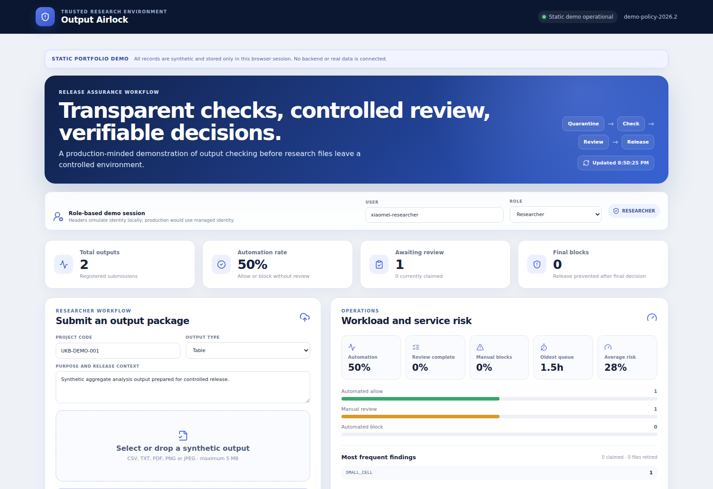
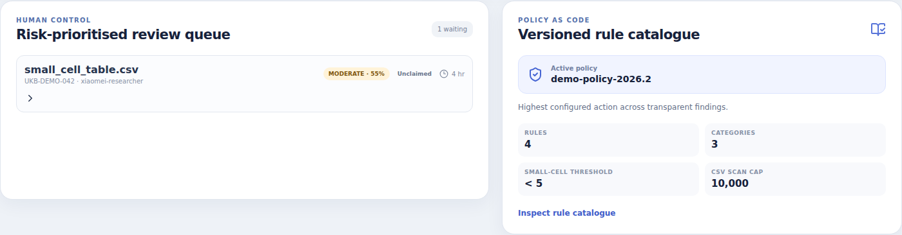
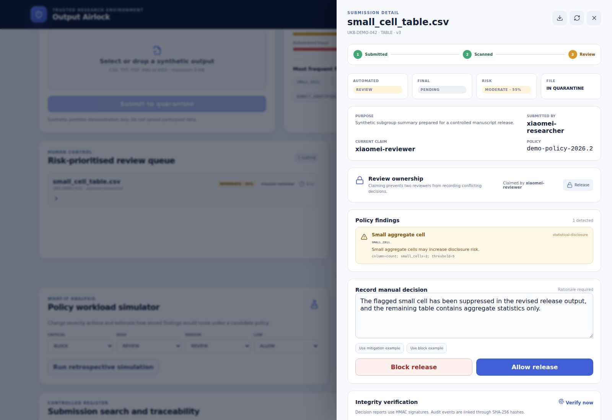

# Clinical–Genomic Data Platform and TRE Output Airlock

[](https://github.com/xm2325/tre_output_airlock/actions/workflows/ci.yml)
[](https://github.com/xm2325/tre_output_airlock/actions/workflows/backend-service.yml)
[](https://github.com/xm2325/tre_output_airlock/actions/workflows/clinical-genomic-pipeline.yml)
[](https://github.com/xm2325/tre_output_airlock/actions/workflows/pages.yml)

[Open the browser-only Airlock demo](https://xm2325.github.io/tre_output_airlock/) · [Review the clinical–genomic pipeline](clinical_genomic_pipeline/README.md) · [Read the identity/backend design](docs/identity-and-backend-platform.md) · [Read production limits](docs/production-readiness.md)

A production-minded portfolio project showing the controlled data path around a trusted research environment (TRE): secure synthetic clinical and genomic acquisition, validation, standardisation, research-ready data publication, and disclosure review before outputs leave the TRE.

> **Safety boundary:** all clinical and genomic records are synthetic. This repository is not affiliated with UK Biobank or Genomics England, does not implement their policies, and must not be used with real participant data. AWS service infrastructure in this repository is a CI-validated reference design, not a claimed live production deployment.

## Problems addressed

A regulated health-data platform must control both sides of research use.

Before analysis, it must prove that files arrived intact, detect breaking source changes, validate clinical and genomic references, remove direct identifiers, standardise data models, record lineage, measure data quality and prevent restricted linkage data from entering curated storage.

After analysis, it must inspect requested outputs, explain risk evidence, route uncertain cases to reviewers, prevent conflicting actions and preserve an auditable decision history.

## End-to-end control path


```mermaid
flowchart LR
  A[Aspera, Globus or local delivery] --> B[Receiver-side transfer receipt]
  B --> C[Byte count, path and SHA-256 checks]
  C -->|invalid| Q[Ingestion quarantine]
  C --> D[FHIR and genomic data contract]
  D -->|breaking drift| Q
  D --> E[Reference, assembly and file validation]
  E --> F[De-identification and linkage]
  F --> G[Silver clinical tables]
  F --> H[OMOP-aligned gold tables]
  H --> I[Terminology and relationship quality]
  I --> J[Atomic publish, lineage and metrics]
  J --> K[AWS curated publish plan]
  K --> L[TRE research use]
  L --> M[Researcher output submission]
  M --> N[Airlock disclosure checks]
  N --> O{Versioned release policy}
  O -->|ALLOW| P[Signed release decision]
  O -->|REVIEW| R[Leased human review]
  O -->|BLOCK| S[Automated block]
  R --> P
  P --> T[Hash-linked audit verification]
  S --> T
```

## Engineering evidence

| Capability | Repository evidence |
|---|---|
| Backend Python / REST | FastAPI service, typed schemas, OpenAPI export, bounded signed keyset cursor pagination with deterministic tie-breakers, PostgreSQL/SQLAlchemy and Alembic migrations |
| Identity and authorisation | OAuth2/OIDC token introspection with issuer/audience/expiry checks, configurable IdP group-to-RBAC mapping, explicit 401/403/503 paths, and a bounded short-lived successful-introspection cache |
| Identity resilience | 15-second default cache TTL capped by token `exp`, HMAC-SHA256 token/config digests, bounded LRU eviction, failure non-caching, per-token single-flight protection and IdP latency/cache telemetry |
| Concurrency and workflow safety | Optimistic `row_version` compare-and-swap, transactional claim + audit persistence, 30-minute review-claim leases, expired-claim recovery and idempotent submission handling |
| PostgreSQL / RDS | PostgreSQL-backed local stack, bounded per-task SQLAlchemy pool sizing/timeouts/recycling, live Prometheus pool saturation gauges, explicit 503 checkout-timeout handling, one-off migrations, and PostgreSQL 16 exhaustion/recovery CI |
| AWS backend service | Terraform for API Gateway, private ALB, ECS Fargate, RDS PostgreSQL, encrypted EFS, Secrets Manager, CloudWatch and constrained IAM roles; format/init/validate run in GitHub Actions |
| ETL/ELT pipelines | FHIR, genomic manifest and VCF ingestion with stable run IDs and atomic publication |
| Clinical and genomic data | Patient, condition, observation, specimen and genomic sample linkage |
| Secure transfer | Aspera/Globus-style receipt with endpoints, bytes, retries, resume state and receiver-side SHA-256 |
| FHIR, OMOP and terminology | FHIR R4 subset, OMOP-aligned tables, SNOMED and LOINC concept mapping |
| Data quality | Schema drift, foreign keys, required fields, terminology coverage and quarantine issue codes |
| Metadata and lineage | Source hashes, schema fingerprint, transfer ID, code revision, model status and run metrics |
| AWS data controls | Terraform S3/KMS/SQS baseline and tested SSE-KMS curated publication plan |
| CI/CD and QA | Ruff, strict MyPy, pytest/coverage, dependency audits, release-version contract, PostgreSQL migration/test contract, frontend tests/build, Docker full-stack integration and container builds |

## Clinical–genomic ingestion capabilities

- versioned transfer receipt for `ASPERA`, `GLOBUS` or local delivery context;
- receiver-side byte count and SHA-256 validation;
- supported FHIR R4 subset for `Patient`, `Condition`, `Observation` and `Specimen`;
- genomic manifest validation for patient, specimen, assembly, safe path and checksum;
- schema contract with `PASS`, `WARN` and `FAIL` outcomes;
- value-free schema fingerprint recorded in lineage;
- HMAC pseudonyms and deterministic patient-level date shifts;
- bronze, silver, gold and restricted data zones;
- OMOP-aligned `person`, `condition_occurrence`, `measurement` and `specimen` tables;
- versioned SNOMED and LOINC mapping fixture with coverage reporting;
- OMOP primary-key, foreign-key and required-field checks;
- staging, atomic publication, `_SUCCESS` and safe replay;
- Prefect preflight, processing and evidence tasks;
- operations JSON and standalone HTML;
- AWS curated publication plan that excludes bronze, silver and restricted data;
- Terraform for encrypted landing, quarantine, curated and restricted storage plus SQS/DLQ.

## TRE Output Airlock capabilities

The release workflow has three outcomes:

- `ALLOW`: no configured release concern was detected;
- `REVIEW`: a reviewer must claim the item and record a rationale;
- `BLOCK`: a critical condition prevents release.

The Airlock includes:

- researcher, reviewer and admin scopes;
- owner filtering and risk-prioritised review queues;
- transactional review-claim and hash-linked audit persistence;
- configurable review-claim leases with safe expired-claim reassignment;
- optimistic concurrency based on `row_version`;
- signed actor/filter/sort-bound keyset cursor pagination for submission listing, while retaining the existing bounded page/offset API for browser compatibility;
- OAuth2/OIDC token-introspection identity with configurable IdP group-to-role mapping;
- bounded short-lived successful-introspection caching with token-expiry capping and LRU eviction;
- keyed per-process single-flight coordination so concurrent misses for the same token/config share one upstream introspection while different tokens remain concurrent;
- direct-identifier, quasi-identifier, small-cell, uniqueness and free-text checks;
- versioned release policy and policy workload simulation;
- HMAC-signed reports and SHA-256-linked audit events;
- PostgreSQL, Alembic migrations and FastAPI;
- React and TypeScript dashboard;
- Prometheus-style HTTP, OIDC cache/single-flight, IdP latency and live PostgreSQL pool saturation/timeout metrics plus readiness checks;
- a nine-case synthetic benchmark;
- Docker Compose integration and container builds.

## AWS backend-service reference

The backend service has a separate Terraform reference path:

```text
API Gateway HTTP API
    -> VPC Link
    -> internal ALB
    -> private ECS Fargate tasks
         -> private RDS PostgreSQL
         -> encrypted EFS working-file volume
         -> OAuth2/OIDC token introspection over HTTPS
```

Runtime database credentials, the IdP client secret and report-signing material are injected through Secrets Manager. The service task has no public IP. The application task role intentionally has no AWS control-plane permissions because the current FastAPI process does not call AWS APIs directly. The ECS reference passes both the bounded OIDC cache settings and the PostgreSQL pool budget to each task. The default application budget is 5 persistent connections plus 5 overflow connections per task; production sizing must account for task count and database headroom. See [`infra/aws/backend_service/README.md`](infra/aws/backend_service/README.md) and [`docs/identity-and-backend-platform.md`](docs/identity-and-backend-platform.md).

## Browser-only Airlock demo

The GitHub Pages build runs entirely in the browser with synthetic in-memory records. It supports role switching, review claims, policy simulation, report verification and synthetic uploads without sending files to a server.

### Researcher operations dashboard



### Risk-prioritised reviewer queue



### Claimed review with evidence and decision controls



## Run the clinical–genomic pipeline

```bash
cd clinical_genomic_pipeline
python -m pip install -e '.[orchestration]'

clinical-genomic-transfer-receipt \
  --delivery-root samples \
  --file fhir_bundle.json \
  --file genomic_manifest.csv \
  --file genomics/sample_001.vcf \
  --output build/transfer-receipt.json \
  --tool GLOBUS \
  --transfer-id demo-transfer-001

clinical-genomic-pipeline \
  --fhir samples/fhir_bundle.json \
  --manifest samples/genomic_manifest.csv \
  --transfer-receipt build/transfer-receipt.json \
  --terminology-map reference/terminology_map.csv \
  --output build/demo \
  --secret 'replace-with-a-long-demo-secret'

clinical-genomic-operations \
  --output build/demo \
  --json build/demo/operations-summary.json \
  --html build/demo/operations-dashboard.html
```

See [`clinical_genomic_pipeline/README.md`](clinical_genomic_pipeline/README.md) for Prefect execution, outputs, test cases and cloud publication controls.

## Run the Airlock

```bash
cp .env.example .env
docker compose up --build
```

Open:

- dashboard: `http://localhost:5173`
- API documentation: `http://localhost:8000/docs`
- readiness: `http://localhost:8000/ready`
- telemetry: `http://localhost:8000/metrics`

Docker Compose uses PostgreSQL. The API container runs `alembic upgrade head` before startup by default. Multi-task service deployment can set `AIRLOCK_RUN_MIGRATIONS=false` and run one explicit migration task before updating the service.

## Validation evidence

The clinical–genomic workflow checks:

- Ruff and strict MyPy;
- transfer receipt creation and tamper detection;
- unit tests for contracts, transfer, privacy, OMOP, terminology, AWS and operations;
- repeatable pipeline execution;
- staged Prefect flow;
- direct-identifier scans across silver and gold;
- contract, transfer, quality, lineage, OMOP and operations artifacts;
- AWS curated plan with restricted-data exclusion;
- Terraform format, initialisation and validation.

The current Airlock backend contract checks:

- **78 backend tests collected**: **77 passed + 1 PostgreSQL-only skipped** on the standard SQLite backend job with **91.22% coverage** against a 90% gate;
- Ruff and strict MyPy;
- Python dependency audit;
- cross-stack release-version consistency across runtime/package/lock metadata;
- database migration and OpenAPI export;
- nine-case synthetic policy benchmark;
- OAuth2/OIDC cache, expiry, failure and numeric-configuration regression paths;
- threaded OIDC single-flight regression paths: eight same-token concurrent calls collapse to one simulated upstream call, different tokens can reach the simulated IdP concurrently, shared failures are not cached, and TTL-zero mode coalesces only in-flight work;
- transactional review-claim rollback and expired-lease recovery;
- signed cursor regression paths covering three stable sort orders, equal-key tie-breaks, no duplicate/gap traversal, actor/filter binding, tamper rejection and bounded page size;
- frontend dependency audit, typecheck, unit tests and build;
- Docker Compose configuration and full-stack route verification;
- final container build.

The dedicated AWS backend-service workflow separately starts **PostgreSQL 16**, applies Alembic through **`0002(head)`**, verifies both cursor-pagination composite indexes in `pg_indexes`, and collects the same **78 tests**, with **77 passed + 1 SQLite-only skipped**. Its pool contract still uses 3 persistent + 2 overflow connections, occupies all five, verifies live metrics report utilisation `1.0` and zero remaining capacity, checks `/ready` and a database-backed API return **503** under exhaustion, verifies the checkout-timeout counter increments, releases the held connections, then confirms utilisation returns to `0.0`, readiness recovers and `SELECT 1` succeeds. It also checks Terraform format, `init -backend=false` and `validate`. These checks validate code and configuration; they do not demonstrate a live AWS or real IdP deployment.

## Repository structure

```text
backend/                                FastAPI Airlock service, migrations and tests
frontend/                               React and TypeScript Airlock dashboard
clinical_genomic_pipeline/              Transfer, FHIR/VCF, OMOP, quality and operations
benchmark/                              Synthetic Airlock benchmark
samples/                                Synthetic release-review files
infra/aws/                              Airlock AWS quarantine baseline
infra/aws/clinical_genomic/             Clinical-genomic S3, KMS, SQS and IAM baseline
infra/aws/backend_service/              API Gateway, ECS, RDS, EFS, IAM and Secrets Manager reference
docs/identity-and-backend-platform.md   OIDC/IdP, RDS and backend-service design
docs/clinical-genomic-platform.md       Upstream data-platform design
docs/production-readiness.md            Demonstrated controls and remaining work
docs/adr/                               Architecture decision records
```

## Production boundary

Read [`docs/production-readiness.md`](docs/production-readiness.md) before describing the project as production-ready. The AWS backend path is a statically validated reference deployment and the OIDC tests mock the identity-provider network boundary. A successfully introspected token can remain accepted until the deliberately short cache TTL expires if it is revoked immediately after introspection; deployments requiring immediate revocation can disable the resident cache. Single-flight coordination is per API process, so separate ECS tasks can each perform one introspection for the same cold token. Keyset cursors are stateless and avoid deep `OFFSET` scans, but they do not provide snapshot isolation: concurrent submissions or rechecks that change a mutable sort key such as `risk_score` can move records between traversal steps. A real service would still require an approved IdP tenant and claim contract, applied cloud infrastructure, operational alerting, live secret rotation, database recovery tests, pool sizing against the deployed RDS `max_connections` and ECS task count with migration/administration/failover headroom, malware scanning, formal privacy/security review and representative source-system validation.

## Author

**Xiaomei Mi**  
PhD in Computer Science · Python · machine learning · health data · research software