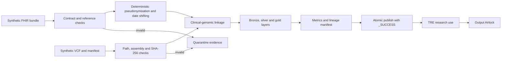

# Clinical–Genomic Ingestion Pipeline

This package adds an upstream data-engineering path to the TRE Output Airlock. It demonstrates how a synthetic FHIR delivery and a synthetic VCF delivery can be checked, de-identified, linked, recorded and published as research-ready tables before output disclosure review begins.

> **Safety boundary:** all records are synthetic. The package is not a clinical system, does not implement a complete FHIR or OMOP specification, and must not be used for real patient data.

## Problem

Clinical and genomic deliveries often arrive from different systems. Before researchers use them, a platform must check source integrity, validate identifiers, remove direct identifiers, create stable pseudonyms, record data lineage, isolate failed deliveries and publish only complete runs.

## Demonstrated flow



## What is implemented

- a small FHIR R4 contract for `Patient`, `Condition`, `Observation` and `Specimen`;
- reference-integrity checks across FHIR resources;
- manifest validation for patient, specimen, genome assembly, path and SHA-256;
- HMAC-based stable pseudonyms with a secret supplied at run time;
- deterministic patient-level date shifting that keeps within-person intervals;
- removal of name and address fields from research tables;
- bronze source capture, silver clinical tables and a gold joined cohort;
- restricted linkage data kept outside the research-ready gold layer;
- run IDs derived from source digests and pipeline version;
- repeatable execution, staging and atomic publication;
- quarantine evidence for invalid deliveries;
- source digests, configuration digest, code revision and run metrics;
- a Prefect flow with retry boundaries;
- Terraform for encrypted AWS landing, quarantine and curated buckets plus a dead-letter queue;
- CI checks for code, tests, sample execution, privacy assertions and Terraform validation.

## Run the pure-Python path

```bash
cd clinical_genomic_pipeline
python -m pip install -e .
python -m clinical_genomic_pipeline.cli \
  --fhir samples/fhir_bundle.json \
  --manifest samples/genomic_manifest.csv \
  --output build/demo \
  --secret 'replace-with-a-long-demo-secret'
```

Run it a second time with the same inputs. The pipeline returns the existing successful run rather than publishing a duplicate.

## Run with Prefect

```bash
python -m pip install -e '.[orchestration]'
python -c "from clinical_genomic_pipeline.flow import clinical_genomic_flow; clinical_genomic_flow('samples/fhir_bundle.json', 'samples/genomic_manifest.csv', 'build/prefect', 'replace-with-a-long-demo-secret')"
```

## Output contract

```text
build/demo/
├── quarantine/<run_id>/validation_issues.json
└── runs/<run_id>/
    ├── bronze/
    ├── silver/
    ├── gold/research_cohort.csv
    ├── restricted/patient_linkage.csv
    ├── lineage.json
    ├── metrics.json
    └── _SUCCESS
```

The `restricted` directory is present to show the security boundary. A production deployment would use separate permissions and storage, not only a directory boundary.

## Failure cases covered by tests

- source checksum mismatch;
- invalid patient or specimen reference;
- duplicate resource and sample identifiers;
- unsupported genome assembly;
- path traversal outside the delivery directory;
- attempted use of a short pseudonymisation secret;
- rerun after a successful publication.

## Production gaps

A real implementation would still require approved identity and access management, managed secrets and keys, complete FHIR profile validation, approved terminology services, transfer tooling such as Aspera or Globus, malware scanning, object-lock policy, managed Prefect infrastructure, central logs and alerts, data retention controls, formal privacy review and validation with representative source systems.
