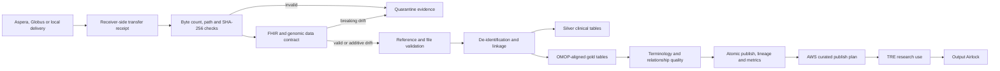

# Clinical–Genomic Data Engineering Pipeline

This package demonstrates the controlled path from synthetic clinical and genomic delivery to research-ready data. It adds receiver-side transfer evidence, contract validation, de-identification, an OMOP-aligned data model, terminology quality, Prefect orchestration, AWS publication controls and downstream TRE output review.

> **Safety boundary:** all records are synthetic. This is not a clinical system, a complete FHIR or OMOP implementation, an Aspera/Globus connector, or an approved de-identification service. It must not be used with real patient data.

## Operational problem

Clinical and genomic data arrive from separate systems, often through high-volume transfer services. Before they are used for research, a data platform must prove that the delivery completed, verify bytes and checksums, reject breaking schema changes, link patients and specimens, remove direct identifiers, standardise research tables, measure terminology coverage, record lineage and prevent restricted linkage material from entering curated storage.

## Demonstrated flow



## JD-aligned capabilities

| Data engineering requirement | Demonstrated evidence |
|---|---|
| Large clinical and genomic pipelines | FHIR, manifest and VCF delivery with deterministic run IDs and atomic publication |
| Aspera or Globus-style acquisition | Versioned transfer receipt with tool, endpoint, byte count, retries, resume state and receiver-side SHA-256 |
| Healthcare standards | FHIR R4 subset plus OMOP-aligned `person`, `condition_occurrence`, `measurement` and `specimen` tables |
| SNOMED and LOINC | Versioned terminology map, standard concept IDs and explicit mapping-coverage report |
| Data quality | Contract drift, foreign keys, required fields, OMOP relationships, terminology coverage and quarantine issue codes |
| Metadata and lineage | Source hashes, schema fingerprint, transfer ID, code revision, model status and run metrics |
| Prefect orchestration | Separate preflight, processing and evidence tasks with different retry policies |
| AWS and security | Terraform landing zones plus a tested curated S3 plan using SSE-KMS and a hard deny for `restricted/` |
| CI/CD and automation | Ruff, strict MyPy, unit tests, privacy scans, Prefect smoke test, evidence artifacts and Terraform validation |
| Product and QA integration | Machine-readable contract, transfer, quality, metrics and operations reports plus portable HTML |

## Build a transfer receipt

The command computes receiver-side file sizes and SHA-256 digests. `GLOBUS` and `ASPERA` indicate the transfer context; the demo does not call either vendor service.

```bash
cd clinical_genomic_pipeline
python -m pip install -e '.[orchestration]'
clinical-genomic-transfer-receipt \
  --delivery-root samples \
  --file fhir_bundle.json \
  --file genomic_manifest.csv \
  --file genomics/sample_001.vcf \
  --output build/transfer-receipt.json \
  --tool GLOBUS \
  --transfer-id demo-transfer-001
```

## Run the pipeline

```bash
clinical-genomic-pipeline \
  --fhir samples/fhir_bundle.json \
  --manifest samples/genomic_manifest.csv \
  --transfer-receipt build/transfer-receipt.json \
  --terminology-map reference/terminology_map.csv \
  --output build/demo \
  --secret 'replace-with-a-long-demo-secret'
```

An identical second run reuses the committed run rather than publishing a duplicate.

## Run with Prefect

```bash
python - <<'PY'
from clinical_genomic_pipeline.flow import clinical_genomic_flow

clinical_genomic_flow(
    "samples/fhir_bundle.json",
    "samples/genomic_manifest.csv",
    "build/transfer-receipt.json",
    "reference/terminology_map.csv",
    "build/prefect",
    "replace-with-a-long-demo-secret",
)
PY
```

The flow has three visible task boundaries: delivery preflight, clinical-genomic processing and run-evidence summary.

## Build operations evidence

```bash
clinical-genomic-operations \
  --output build/demo \
  --json build/demo/operations-summary.json \
  --html build/demo/operations-dashboard.html
```

The summary reports success rate, quarantine state, transfer tools and retries, contract warnings, OMOP quality, terminology coverage, published samples and incomplete staging directories.

## Output contract

```text
build/demo/
├── quarantine/<run_id>/
│   ├── validation_issues.json
│   ├── contract_report.json
│   ├── transfer_report.json
│   └── data_quality_report.json
└── runs/<run_id>/
    ├── bronze/
    │   ├── fhir_bundle.json
    │   ├── genomic_manifest.csv
    │   ├── transfer_receipt.json
    │   └── terminology_map.csv
    ├── silver/
    ├── gold/
    │   ├── research_cohort.csv
    │   └── omop/
    │       ├── person.csv
    │       ├── condition_occurrence.csv
    │       ├── measurement.csv
    │       └── specimen.csv
    ├── restricted/
    ├── contract_report.json
    ├── transfer_report.json
    ├── data_quality_report.json
    ├── lineage.json
    ├── metrics.json
    └── _SUCCESS
```

## AWS curated publication boundary

`build_curated_publish_plan` selects only gold data and operational evidence. It excludes bronze, silver and restricted linkage material. `upload_curated_publish_plan` uses a boto3-compatible client with `aws:kms`, a required KMS key and digest/classification metadata. CI uses a fake client; no cloud credentials or deployment are claimed.

## Failure and warning cases covered by tests

The tests cover transfer tampering, missing transfer files, checksum mismatch, path escape, breaking and additive schema drift, identifier and specimen linkage, direct-identifier leakage, unknown terminology, OMOP primary/foreign-key checks, idempotent replay, S3 restricted-data exclusion and operations reporting.

## Production gaps

A real service would still require managed transfer APIs and credentials, malware scanning, complete FHIR profiles, an approved terminology service and vocabulary release process, full OMOP CDM validation, workload identity, managed Prefect workers, private networking, object retention and lock policies, central telemetry, alert routing, formal privacy review and representative source-system testing.
