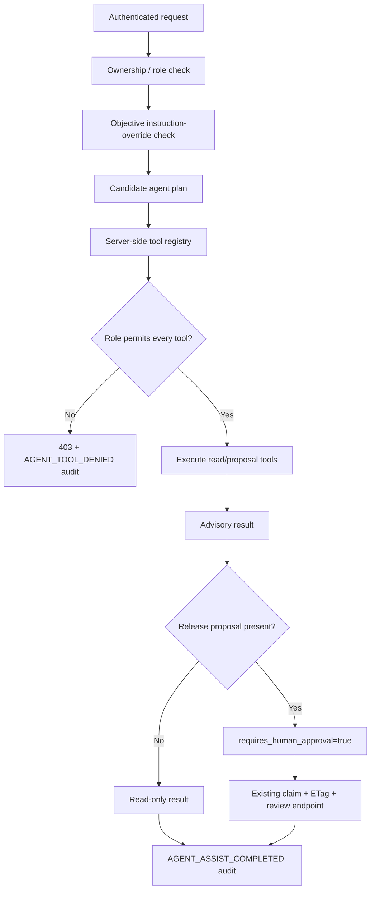

# Agentic productivity control plane

This branch adds a small agent-assist slice to the existing TRE Output Airlock backend. The aim is to show how a tool-using AI assistant can sit inside an authenticated, audited workflow without receiving direct authority to make a release decision.

## Current scope

The implementation is intentionally narrow.

- The API accepts a natural-language objective for one existing submission.
- A deterministic local planner produces a candidate tool plan. It is a test fixture for the control plane, not a claimed intelligent planner.
- Every candidate tool is checked against a server-side registry and the authenticated actor role before execution.
- Read tools can inspect submission state and policy evidence.
- A reviewer or admin can request a non-binding release-action proposal.
- The proposal never writes `final_decision`, changes `row_version`, claims a review item, or bypasses the existing manual-review endpoint.
- Successful, denied and instruction-override attempts are written to the existing hash-linked audit chain.
- The raw objective is not written to the audit record; only its SHA-256 digest is stored.

A future LLM planner can replace the deterministic planner while keeping the same validation and execution boundary.

## Control flow



## Tool registry

| Tool | Effect | Researcher | Reviewer | Admin |
|---|---|---:|---:|---:|
| `get_submission_context` | read | yes, own submissions only | yes | yes |
| `get_policy_evidence` | read | yes, own submissions only | yes | yes |
| `propose_release_action` | advisory proposal only | no | yes | yes |

The researcher ownership rule is inherited from the existing `_get_submission` access boundary.

## State-change boundary

The agent-assist endpoint cannot complete a review. A final release decision still goes through the existing review path, which already requires reviewer/admin authority and uses review claims, strong ETags / `If-Match`, database compare-and-swap and audit persistence.

This separation is deliberate:

```text
agent proposal != authorised action
```

The agent may collect evidence and suggest an action. The backend remains the authority for identity, permissions, concurrency and durable state changes.

## Safety and failure cases covered in the first slice

The first test set checks that:

1. a reviewer can obtain a release proposal without changing `final_decision` or `row_version`;
2. a researcher cannot use the release-proposal tool;
3. an unknown tool is rejected by the server-side registry;
4. obvious instruction-override patterns are rejected before planning/execution;
5. successful agent assistance is written to the audit chain;
6. denied tool use is written to the audit chain;
7. rejected instruction-override requests are audited using an objective digest rather than the raw text;
8. a researcher cannot use agent assistance to read another researcher's submission.

The instruction-override check is a narrow first control, not a complete prompt-injection defence. Later work should add adversarial evaluation, model/provider isolation, tool-call schema validation, output constraints, timeouts and model-failure handling.

## API example

```http
POST /api/v1/submissions/{submission_id}/agent-assist
X-Demo-User: reviewer-1
X-Demo-Role: reviewer
Content-Type: application/json

{
  "objective": "Review the policy evidence and recommend whether this output should be released."
}
```

The response includes the tools used, policy/risk evidence, an optional `proposed_action`, `requires_human_approval`, safety flags and a per-tool trace.

## Claim boundary

This branch does **not** claim that an LLM is deployed in production. The current planner is deterministic so that the tool-policy and audit boundary can be tested without an external model dependency. It also does not claim that the AWS reference architecture is a live deployment.

The engineering evidence in this slice is the control plane around a future agent: authenticated access, role-scoped tools, advisory-only state semantics, human approval, durable audit and regression tests.
