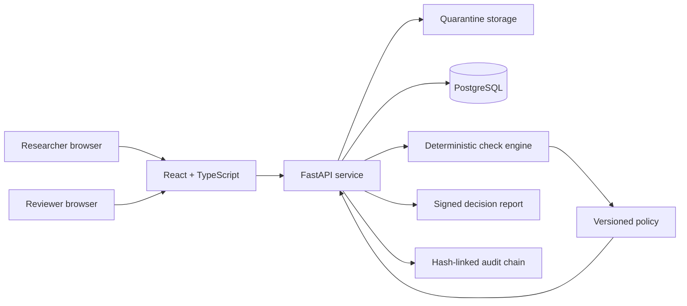
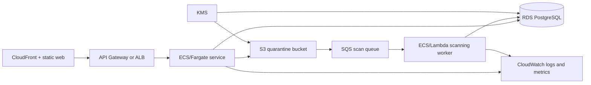

# Architecture

## Purpose

TRE Output Airlock is a synthetic portfolio system for checking research outputs before they leave a controlled environment. The design keeps automated evidence, policy decisions and human review separate so each part can be tested and changed independently.

## Runtime components

Docker Compose uses PostgreSQL and a persistent quarantine volume. Direct local execution can use SQLite to reduce setup cost.

## Request path

1. The browser sends a synthetic file, project code, output type and release purpose.
2. The API streams bytes into quarantine and records a SHA-256 fingerprint.
3. The system records `SUBMITTED`, `QUARANTINED` and `SCAN_STARTED` audit events.
4. File integrity, disclosure-risk and metadata checks produce findings.
5. The active policy maps findings to `ALLOW`, `REVIEW` or `BLOCK`.
6. `REVIEW` items enter a risk-ordered queue.
7. A reviewer claims the item before recording a decision. The client sends the expected row version to prevent stale updates.
8. The API retains automated evidence and records the human rationale.
9. A signed JSON report and a hash-linked audit chain support later verification.

## Boundary between checks and policy

Checks answer: **what was detected?**

Policy answers: **what workflow action follows from the detected evidence?**

A check returns a rule code, severity, redacted evidence and message. The policy catalogue assigns a default action. The most restrictive action wins. This allows the team to test detection code without hiding release policy inside model logic.

## Identity and permissions

The local demo reads `X-Demo-User` and `X-Demo-Role` headers. It demonstrates three scopes:

- `researcher`: submit files and view only submissions created under the same user name;
- `reviewer`: view the queue, claim work, recheck and record review decisions;
- `admin`: reviewer access plus retention operations and claim override.

The headers are not an authentication system. A deployed service should use an identity provider, validated tokens and server-side group mapping.

## Concurrency controls

Review claims reduce duplicate work. The `row_version` field provides optimistic concurrency control. A stale review request returns HTTP 409 rather than overwriting a newer state.

## Data integrity controls

- SHA-256 file fingerprint;
- HMAC-SHA256 decision report signature;
- SHA-256 event chain where each audit record includes the previous hash;
- policy version stored with each decision;
- request ID propagated to logs and audit events;
- database migration history through Alembic.

These controls make accidental or unauthorised changes easier to detect. They do not replace access control, managed keys or independent security monitoring.

## Production deployment mapping

`infra/aws/` provides a small infrastructure baseline for encrypted quarantine storage, a scan queue, a dead-letter queue and an alert. It is not a complete production deployment.

## Current limits

- checks use synthetic patterns and have not been validated against real research outputs;
- local role headers are deliberately not secure authentication;
- upload and checking are synchronous in the demo;
- malware and document sandboxing are not implemented;
- HMAC uses a local environment secret rather than a managed signing service;
- retention deletion is explicit rather than scheduled.
